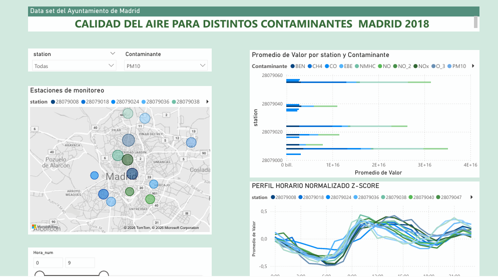

# Air Quality Analysis - Madrid
##  Project Overview
This project analyzes air quality data in Madrid using historical data from monitoring stations for year 2018.

The objective is to identify pollution patterns, detect extreme events, and explore spatial distribution using georeferenced stations.

---

##  Tools & Technologies
- Python (pandas, numpy)
- Google Colab
- Power BI
- GitHub

---

## Data Sources
- Madrid Open Data Portal
- Processed dataset from Kaggle

---

## Analysis Performed
- Data cleaning and restructuring
- Handling missing values
- Z-score normalization
- Detection of extreme pollution events
- Station-based analysis
- Time series exploration

---

## Dashboard
Power BI dashboard includes:
- Pollution trends over time
- Station comparison
- Extreme events visualization
- Geospatial analysis

---

## Repository Structure
air-quality-madrid/
│
├── data/
│   ├── raw/
│   ├── processed/
│
├── notebooks/
│
├── powerbi/
│
├── images/
│
├── README.md
├── requirements.txt
└── .gitignore

---

## Key Insights
Insight 1 — patrón temporal

“Se observa un aumento sistemático de contaminantes durante las horas punta (mañana, ~ 9:00 am y tarde ~ 05:00 pm ), lo que sugiere una fuerte relación con la actividad vehicular.”

Insight 2 — variabilidad espacial

“Las estaciones presentan diferencias significativas en magnitud, indicando que la contaminación no es homogénea y depende de la ubicación dentro de la ciudad.”

Insight 3 — comportamiento dinámico

“Al analizar la evolución por hora, se detectan cambios rápidos en los niveles de contaminación, lo que evidencia la importancia de monitoreo en tiempo real para la toma de decisiones.”

---

## Preview

